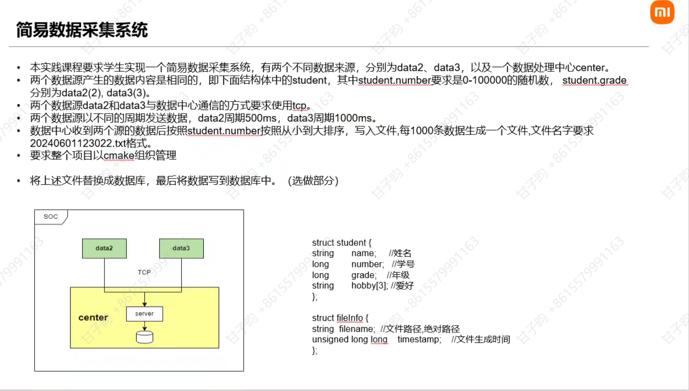

# 简易数据采集系统

## Project0
 - 完成了主要功能
    - 其中build.sh为shell脚本，用来进行cmake编译，节省流程
    - build文件夹中包含了可执行文件等cmake出来的文件
    - Project0/figure 文件夹是所包含的是对应的程序截图
    - Project0/log 文件夹中包含了生成的对应文档
## Project1
 - 在Project0的基础上完成了附加功能
    - 其中build.sh为shell脚本，用来进行cmake编译，节省流程
    - build文件夹中包含了可执行文件等cmake出来的文件
    - Project1/figure 文件夹是所包含的是对应的程序截图
    - Project1/build 文件夹下的student.db是对应的数据库文件，以此来代替生成的txt文件作为存储的方式

